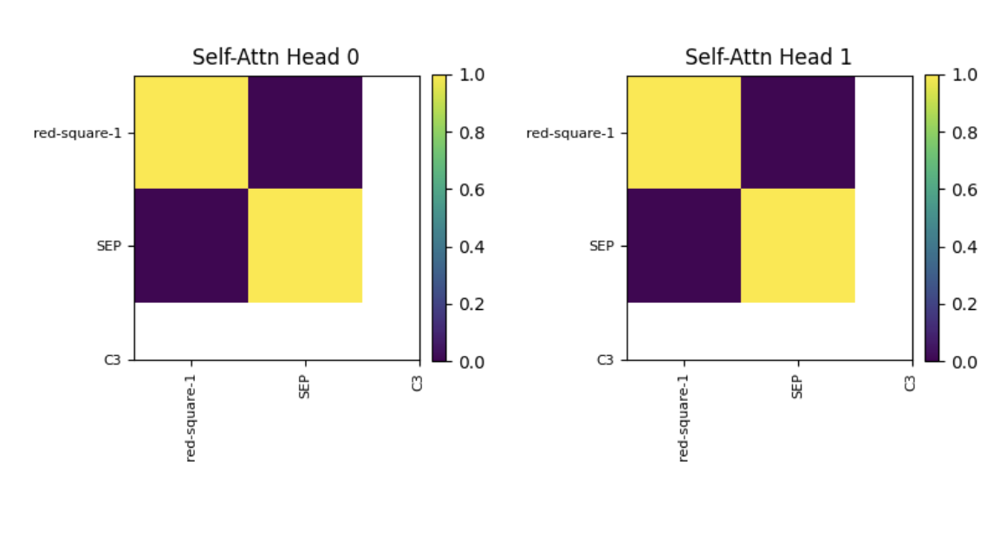
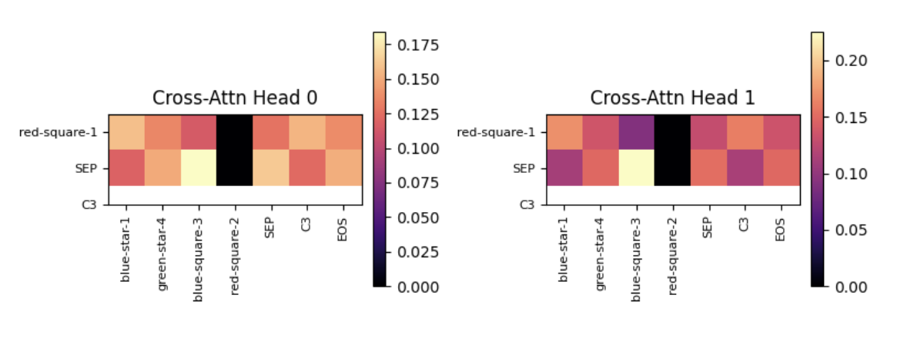

# 🧠 WCST Transformer — Context-Sensitive Cognitive Task Modelling

This repository implements a Transformer-based model trained on a synthetic version of the **Wisconsin Card Sorting Task (WCST)**.
The model learns to infer *category rules* (color, shape, or quantity) from context and apply them to new card-matching problems.
It uses a **Transformer encoder-decoder architecture** with full attention visualization, reproducible training, and Weights & Biases integration.

---

## 🚀 Project Overview

This project simulates the **WCST**, a classic test of cognitive flexibility and rule switching.
The goal is to train a Transformer that can learn to:

* Detect the correct rule (category feature) based on example trials,
* Apply that rule to new cards,
* Adapt when the rule switches (context switching).

The implementation includes:

* ✅ Custom WCST data generator
* ✅ Transformer model with attention visualization
* ✅ Category-wise performance metrics (C1–C4)
* ✅ Reproducibility and checkpointing
* ✅ W&B integration for live monitoring
* ✅ No data leakage between splits

---

## 🧩 Project Structure

```
wcst-transformer/
│
├── transformer.py           # Transformer model (encoder-decoder)
├── decoder.py               # Decoder, EncoderLayer, MHA, FFN, PositionalEncoding
├── prepare_wcst.py          # Dataset generation and DataLoader creation
├── train_wcst_transformer.py# Main training script with W&B logging
├── utils.py                 # Token label mapping and visualization helpers
│
├── checkpoints/             # Saved model checkpoints
├── wcst_data/               # Saved train/val/test splits
│
└── README.md
```

---

## ⚙️ Setup Instructions

### 1️⃣ Clone the repo

```bash
git clone https://github.com/yourusername/wcst-transformer.git
cd wcst-transformer
```

### 2️⃣ Install dependencies

```bash
pip install torch numpy matplotlib wandb tqdm
```

### 3️⃣ Log in to Weights & Biases

```bash
wandb login
```

### 4️⃣ (Optional) Regenerate dataset

You can generate and save new WCST data with:

```python
from prepare_wcst import prepare_wcst_datasets
prepare_wcst_datasets(batch_size=64, num_batches=1000, save_path="./wcst_data", regenerate=True)
```

---

## 🧠 Training the Model

Run:

```bash
python train_wcst_transformer.py
```

This will:

* Load (or generate) training, validation, and test splits
* Initialize the Transformer
* Train for the configured number of epochs
* Log **loss**, **accuracy**, and **per-category accuracy (C1–C4)** to Weights & Biases
* Save best model checkpoints in `./checkpoints/`
* Resume automatically if interrupted

---

## 📊 Logged Metrics (Weights & Biases)

| Metric                       | Description                           |
| ---------------------------- | ------------------------------------- |
| `train_loss`                 | Cross-entropy loss on training data   |
| `val_loss`                   | Cross-entropy loss on validation data |
| `train_accuracy`             | Token-level accuracy during training  |
| `val_accuracy`               | Validation accuracy                   |
| `val_acc_C1`–`val_acc_C4`    | Accuracy per category rule            |
| `test_loss`, `test_accuracy` | Final evaluation metrics              |
| `attention_epoch_*`          | Attention visualizations per epoch    |

---

## 🎨 Attention Visualization

The model logs **decoder self-attention** and **cross-attention** heatmaps per epoch:

* **Top row:** Self-attention heads (decoder focusing on previous tokens)
* **Bottom row:** Cross-attention heads (decoder aligning with encoder tokens)
* Axes are labeled with actual WCST symbols (e.g., `red-circle-2`, `C3`, `SEP`, `EOS`)

Example W&B log:

| Self-Attention Head    | Cross-Attention Head     |
| ---------------------- | ------------------------ |
|  |  |

---

## 🧠 Dataset Summary

The dataset is synthetically generated using the `WCST` class, simulating:

* 64 card combinations (4 colors × 4 shapes × 4 quantities)
* 4 category features (C1–C4)
* `SEP`, `EOS` special tokens
* `PAD` = 0

Each batch includes:

* A **context sequence** (examples of the active rule)
* A **query sequence** (new card to classify)
* Corresponding **labels**

Saved datasets:

```
wcst_data/
│
├── train_src.pt, train_tgt.pt
├── val_src.pt,   val_tgt.pt
└── test_src.pt,  test_tgt.pt
```

---

## 💾 Checkpointing and Reproducibility

* Model checkpoints are saved to `./checkpoints/wcst_transformer.pt`
* Resumes training automatically from the latest epoch
* Fully deterministic via `torch.manual_seed(42)` and CUDA seed settings

---

## 🧠 Research Notes

This framework can be extended for:

* Analyzing **cognitive flexibility** through category-switch accuracy
* Investigating how **attention heads evolve** with context switching
* Comparing learned attention patterns to human rule inference in WCST

---

## 🧪 Example Output

**Console logs:**

```
Epoch 5: TrainLoss=0.2714, ValLoss=0.2989, TrainAcc=0.94, ValAcc=0.92
PerCat={'C1': 0.91, 'C2': 0.93, 'C3': 0.89, 'C4': 0.94}
💾 Saved new best model.
```
## 👤 Authors

**Oratile Nailana**
**Teddy Mngwenya**
**Nthabi Mabetlela**

## 🧭 License

This project is released under the **MIT License**.
